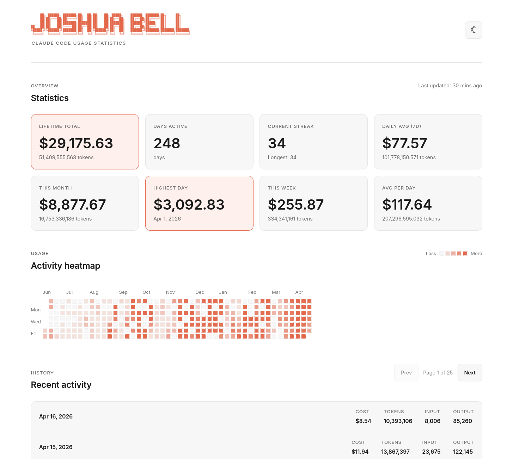

# ccstats

A self-hosted analytics dashboard for tracking your Claude Code usage statistics across multiple machines. Deploy for free on GitHub Pages with zero configuration.



[](LICENSE)
[](https://github.com/joshuabell/ccstats/actions)
[](https://pages.github.com/)

## Features

- **Multi-Device Support**: Aggregate usage from all your machines into one dashboard
- **Comprehensive Stats**: Lifetime, daily, weekly, and monthly usage metrics
- **Streak Tracking**: Monitor your current and longest usage streaks
- **Activity Heatmap**: GitHub-style contribution graph of your usage
- **Activity Timeline**: Paginated daily usage breakdown
- **Dynamic ASCII Art**: Your name rendered as ASCII art in the header
- **Dark/Light Mode**: Automatic theme switching with preference persistence
- **Zero Config**: No databases, no API keys, no external services
- **Git-Based Storage**: All stats stored as JSON files in your repo
- **Deploy Anywhere**: GitHub Pages, Cloudflare Pages, Netlify, or any static host

## Quick Start (5 steps, < 5 minutes)

### 1. Fork & Clone

```bash
# Fork this repo on GitHub, then:
git clone https://github.com/YOUR_USERNAME/ccstats.git
cd ccstats
npm install
```

### 2. Clear Demo Data

The fork includes sample data from the original repo. Remove it so your dashboard starts fresh:

```bash
rm -f data/machines/*.json data/days.json data/stats.json
```

### 3. Configure Your Profile

Edit `config.js` with your info:

```javascript
window.CONFIG = {
  userName: 'Your Name',  // Displayed as ASCII art in header
  userBio: 'Your bio here',
  socials: {
    github: 'yourusername',
    twitter: 'yourhandle',
    // ...
  }
};
```

### 4. Register This Machine

```bash
npm run setup
```

This generates a unique machine ID and saves it to `.env` (gitignored). Each machine that contributes data needs to run this once.

### 5. Generate and Push Your Data

```bash
npm run stats      # Collect usage data from this machine
npm run push       # Commit and push to GitHub
```

**That's it!** Your dashboard will be live at `https://YOUR_USERNAME.github.io/ccstats` in ~1 minute.

## Detailed Setup

### Enable GitHub Pages

1. Go to your repo on GitHub
2. Click **Settings** → **Pages**
3. Under **Build and deployment**:
   - **Source**: GitHub Actions
4. Done! GitHub will auto-deploy on every push

### Custom Domain (Optional)

Want `stats.yourdomain.com` instead of `username.github.io/repo`?

1. Add a `CNAME` file to the root of your repo:
   ```bash
   echo "stats.yourdomain.com" > CNAME
   ```

2. Add DNS records at your domain provider:
   ```
   A    @    185.199.108.153
   A    @    185.199.109.153
   A    @    185.199.110.153
   A    @    185.199.111.153
   ```
   Or for subdomain:
   ```
   CNAME stats YOUR_USERNAME.github.io
   ```

3. Push and wait for DNS propagation (~10 min to 24 hrs)

GitHub provides **free SSL certificates** automatically!

## Updating Your Stats

### Manual Update

```bash
npm run stats      # Pull latest, collect this machine's data, aggregate all machines
npm run push       # Commit and push to GitHub
```

### Automatic Daily Updates (Recommended)

Set up a cron job on each machine:

```bash
# Add to your crontab (crontab -e)
0 23 * * * cd /path/to/ccstats && npm run stats && npm run push
```

This runs every day at 11 PM, updates your stats, and pushes to GitHub. Each machine can run on its own schedule — there's no coordination needed.

## Project Structure

```
.
├── index.html             # Main dashboard page
├── config.js              # YOUR CONFIGURATION (edit this!)
├── setup.js               # Machine registration (generates .env)
├── stats.js               # Data collection, aggregation, and stats
├── .env.example           # Template for machine identity
├── .env                   # YOUR machine identity (git-ignored, created by setup)
├── css/
│   └── style.css          # Dashboard styles
├── js/
│   └── app.js             # Dashboard logic (ASCII art, pagination, heatmap)
├── data/
│   ├── machines/          # Per-machine snapshots (one file per device)
│   │   └── {uuid}.json    # This machine's complete daily history
│   ├── stats.json         # Aggregated statistics (computed)
│   └── days.json          # Aggregated daily data (computed)
├── images/
│   └── example-site.png   # Screenshot for README
├── .github/
│   └── workflows/
│       └── pages.yml      # GitHub Pages deployment
└── package.json           # npm scripts
```

## How It Works

1. **Setup**: `npm run setup` registers this machine with a unique ID stored in `.env`
2. **Pull**: `npm run stats` starts by pulling the latest data from git
3. **Collect**: Runs `ccusage` to get this machine's complete Claude Code usage history
4. **Snapshot**: Writes the full history to `data/machines/{machine-id}.json` (idempotent overwrite)
5. **Aggregate**: Reads all machine files and sums usage per day across devices
6. **Compute**: Calculates statistics from the aggregated daily data
7. **Push**: `npm run push` commits and pushes to GitHub → GitHub Actions deploys to Pages
8. **Display**: The dashboard loads the aggregated data (no backend required!)

## Configuration

Edit `config.js` to customize your dashboard:

```javascript
window.CONFIG = {
  // Profile
  userName: 'Your Name',        // Rendered as ASCII art in header
  userEmail: 'your@email.com',
  userBio: 'Developer & AI enthusiast',
  userLocation: 'San Francisco, CA',
  userTimezone: 'America/Los_Angeles',

  // Social links (leave blank to hide)
  socials: {
    github: 'yourusername',
    twitter: 'yourhandle',
    linkedin: 'https://linkedin.com/in/yourprofile',
    website: 'https://yoursite.com'
  },

  // Site metadata
  siteTitle: 'Claude Code Usage Stats',
  siteDescription: 'My personal Claude Code analytics'
};
```

Changes take effect on next deployment (just `git push`).

## Customization

### Change Theme Colors

Edit `css/style.css`:

```css
:root[data-theme="dark"] {
  --bg-primary: #0a0a0a;
  --accent: #00ff88;      /* Change this! */
  /* ... more variables */
}
```

### Modify Stats Display

Edit `js/app.js` to change calculations or add new metrics.

## Deploy to Other Platforms

This dashboard works on ANY static host. Here are quick guides:

### Cloudflare Pages

1. Connect your GitHub repo
2. Build command: (leave empty)
3. Build output directory: `.` (root)
4. Deploy!

### Netlify

1. Connect your GitHub repo
2. Build command: (leave empty)
3. Publish directory: `.` (root)
4. Deploy!

### Vercel

```bash
npm install -g vercel
vercel
# Follow prompts, set output directory to "."
```

All platforms support custom domains with free SSL.

## Multi-Device Setup

This dashboard supports aggregating usage from **multiple machines** into a single view. Each machine contributes its own data without conflicts.

### Adding a New Machine

On each additional machine that should contribute data:

```bash
git clone https://github.com/YOUR_USERNAME/ccstats.git
cd ccstats
npm install
npm run setup       # Generates a unique machine ID
npm run stats       # Collect and aggregate
npm run push        # Push to GitHub
```

You don't need to clear demo data or edit `config.js` again — those changes are already in the repo from initial setup.

### How It Works

Each machine gets a UUID stored in `.env` (never committed). When you run `npm run stats`:

1. The script pulls the latest `data/machines/` files from git
2. Runs `ccusage` to get this machine's **complete** usage history
3. Overwrites `data/machines/{your-uuid}.json` with the full snapshot
4. Reads **all** machine files and sums usage per day
5. Writes the aggregated `data/days.json` and `data/stats.json`

Because each machine overwrites its own snapshot file, you can run `npm run stats` as many times per day as you want — no data is lost or double-counted.

### Why There Are No Merge Conflicts

Each machine only writes to its own file under `data/machines/`. Two machines never modify the same file, so git merges are always clean.

If a push fails because another machine pushed first, just re-run:

```bash
npm run stats && npm run push
```

The stats command pulls the other machine's data before aggregating.

### Important: Don't Re-run Setup

Running `npm run setup` on an already-registered machine generates a new UUID, which would create a second machine file and cause double-counting. The setup script guards against this — it will refuse to overwrite an existing `.env`.

If you genuinely need to re-register a machine (e.g., after deleting `.env`), also remove the old machine file from `data/machines/`.

### Data Privacy

Your usage stats are stored in your public GitHub repo by default. If you want to keep your data private:

1. Make your repo private (Settings → Danger Zone → Change visibility)
2. GitHub Pages still works with private repos (for Pro accounts)
3. Or use Cloudflare Pages/Netlify (both support private repos for free)

## Development

### Local Testing

```bash
# Serve locally (from repo root)
npx http-server . -p 3000

# Or use any static server
python3 -m http.server 3000
```

Visit `http://localhost:3000`

## npm Scripts

```bash
npm run setup    # Register this machine (generates .env with UUID, run once)
npm run stats    # Pull latest, collect usage, aggregate all machines, save to data/
npm run push     # Commit and push changes to GitHub
```

Combine the daily workflow:
```bash
npm run stats && npm run push
```

## Troubleshooting

### Dashboard shows no data

1. Check that `data/stats.json` and `data/days.json` exist
2. Run `npm run stats` to generate them
3. Commit and push the files
4. Wait ~1 minute for GitHub Pages to deploy

### Stats not updating

1. Make sure you committed the updated JSON files
2. Check GitHub Actions tab for deployment status
3. Hard refresh your browser: `Cmd+Shift+R` (Mac) or `Ctrl+Shift+R` (Windows)

### Custom domain not working

1. Verify `CNAME` file is in the root directory and committed
2. Check DNS records are correct
3. Wait for DNS propagation (up to 24 hours, usually < 1 hour)
4. GitHub Pages → Settings → check for errors

### "No .env file found" error

Run `npm run setup` to register this machine. Every machine needs its own `.env`.

### Stats script fails

1. Make sure `ccusage` is installed: `npm install`
2. Check that you have Claude Code usage data: `npx ccusage --json`
3. Ensure Node.js >= 18

### Push fails after another machine pushed

This is normal. Re-run both commands:
```bash
npm run stats && npm run push
```
The stats command pulls the other machine's data first, then re-aggregates.

### Seeing double-counted data

This happens if `npm run setup` was run twice on the same machine, creating two machine files. Fix it by:
1. Check `data/machines/` for duplicate files from the same device
2. Delete the old/orphaned one
3. Re-run `npm run stats && npm run push`

## Contributing

Contributions welcome! See [CONTRIBUTING.md](CONTRIBUTING.md) for guidelines.

- Open issues for bugs or feature requests
- Submit PRs for improvements
- Share your customized dashboards!

Please note this project follows the [Contributor Covenant Code of Conduct](CODE_OF_CONDUCT.md).

## Security

To report a vulnerability, see [SECURITY.md](SECURITY.md).

## License

MIT License - see [LICENSE](LICENSE) file for details

## Credits

- Built for [Claude Code](https://claude.ai/code) users
- Uses [ccusage](https://github.com/brightbitcode/ccusage) for data collection
- Deployed on [GitHub Pages](https://pages.github.com/) (free forever!)

## Show Your Support

If you found this useful, give it a star on GitHub!

---

**Made with Claude Code**

Need help? [Open an issue](https://github.com/joshuabell/ccstats/issues)
